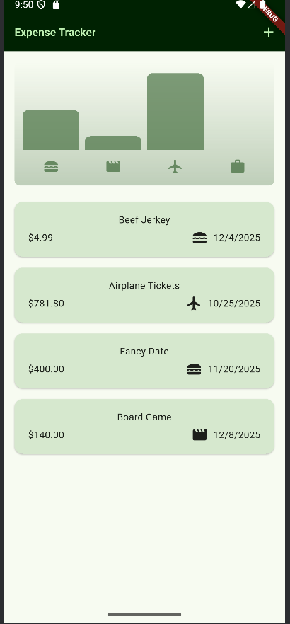
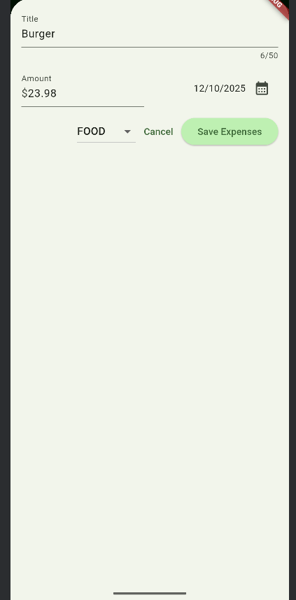

# Expense Tracker

A beautiful and intuitive Flutter expense tracking application that helps you manage and visualize your daily expenses with an elegant chart interface.

## Features

- **Add Expenses**: Quickly add new expenses with title, amount, category, and date
- **Expense Categories**: Organize expenses into categories (Food, Travel, Leisure, Work, Other)
- **Visual Chart**: Interactive bar chart showing spending distribution across categories
- **Swipe to Delete**: Remove expenses with a simple swipe gesture
- **Undo Deletion**: Accidentally deleted an expense? Undo it with a single tap
- **Date Formatting**: Clean, readable date display for all transactions
- **Responsive UI**: Adapts beautifully to different screen sizes

## Screenshots

### Main Screen

The main screen displays a visual chart of your spending patterns across different categories, along with a scrollable list of all your expenses.

### Add New Expense

Easily add new expenses through an intuitive modal form with category selection and date picker.

